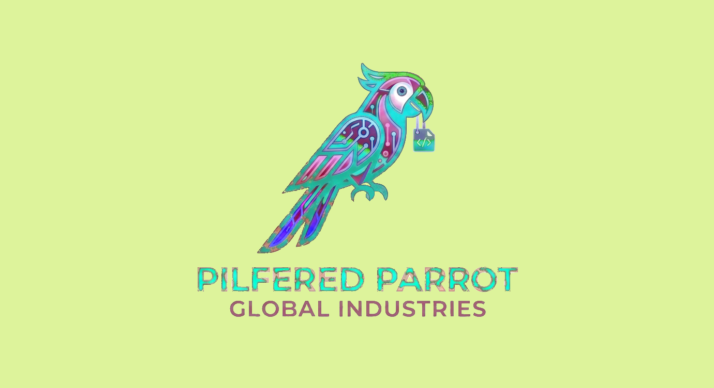

  

# Pilfered Parrot Global Industries

We are an independent game studio and software workshop building unusual, tactile games and the tools that make them possible.

## Now building

### PilferedParrot — Linux preview

A local browser interface for coding CLIs and compatible model APIs. Choose your provider,
keep Work sessions together, and open a separate read-only Chat window. Apache 2.0; Python 3.12+.

[See the interface and get started](https://pilferedparrot.github.io/ai-conductor/) ·
[Download v0.5.0](https://github.com/PilferedParrot/ai-conductor/releases/tag/v0.5.0) ·
[Share first-run feedback](https://github.com/PilferedParrot/ai-conductor/issues/new/choose)

### 3D Bumper Billiards

First-person zero-gravity billiards in a sealed 3D arena.

[Wishlist 3D Bumper Billiards on Steam](https://store.steampowered.com/app/4975340/3D_Bumper_Billiards/)

## Support us

[Support us on Patreon](https://patreon.com/PilferedParrot)

## Contact

For studio, support, and security inquiries, email [pilferedparrot@gmail.com](mailto:pilferedparrot@gmail.com).
