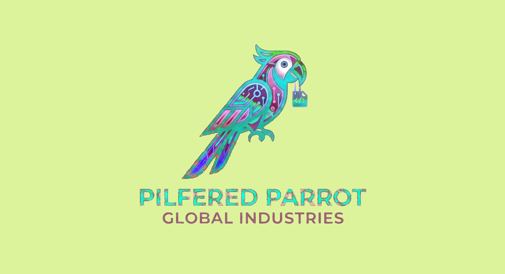

  

# Pilfered Parrot Global Industries

We are an independent game studio and software workshop building unusual, tactile games and the tools that make them possible.

## Now building

### PilferedParrot Interface — Linux and Windows

A local browser interface for coding CLIs and compatible model APIs. Choose your provider,
keep Work sessions together, and open a separate read-only Chat window. Apache 2.0. Linux source
requires Python 3.12+; the Windows 10/11 x64 preview includes Python in a portable ZIP.

[See the interface and get started](https://pilferedparrot.github.io/PilferedParrot-Interface/) ·
[Download the latest release](https://github.com/PilferedParrot/PilferedParrot-Interface/releases/latest) ·
[Share first-run feedback](https://github.com/PilferedParrot/PilferedParrot-Interface/issues/new/choose)

### 3D Bumper Billiards

First-person zero-gravity billiards in a sealed 3D arena.

[Wishlist 3D Bumper Billiards on Steam](https://store.steampowered.com/app/4975340/3D_Bumper_Billiards/)

### Dink Smallwood 3D — Linux and Windows

An unofficial, first-person Godot 4 adaptation of *Dink Smallwood*, built from the original campaign data and art with
new 3D scenery, mouse and controller controls, and first-person combat. In development.

[Source, downloads and release notes](https://github.com/PilferedParrot/dink-smallwood-3d)

## Open-source contributions

- [godot-mcp-328-invisible-geometry](https://github.com/PilferedParrot/godot-mcp-328-invisible-geometry): a reproduction
  scene, runtime audit and guidance experiment for [godot-mcp #328](https://github.com/satelliteoflove/godot-mcp/issues/328) (MIT).

## Support us

[Support us on Patreon](https://patreon.com/PilferedParrot)

## Contact

For studio, support, and security inquiries, email [pilferedparrot@gmail.com](mailto:pilferedparrot@gmail.com).
